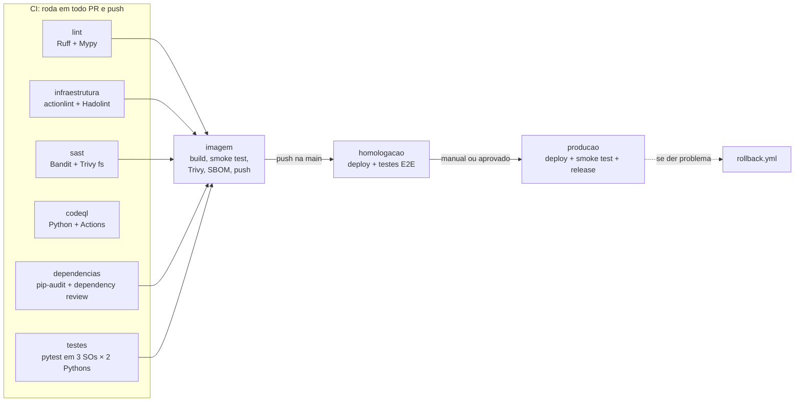

# Pipeline de CI/CD

O arquivo [`.github/workflows/ci-cd.yml`](../.github/workflows/ci-cd.yml) leva uma mudança de código até produção em quatro etapas: **verificação estática**, **verificação dinâmica**, **build da imagem** e **deploy em dois ambientes** (homologação e produção).

## O que é "produção" neste projeto

O conversor é empacotado numa imagem Docker publicada no GitHub Container Registry (GHCR). Cada ambiente é uma tag dessa imagem:

| Ambiente | Tag da imagem | Quem usa | Como chega lá |
|---|---|---|---|
| **homologacao** | `ghcr.io/<dono>/<repo>:homologacao` | testes de ponta a ponta e, se quiser, um Kindle de teste | automático, a cada push na `main` que passa no CI |
| **producao** | `ghcr.io/<dono>/<repo>:producao` | o workflow `convert.yml`, que converte os seus PDFs de verdade | só com decisão humana (execução manual ou aprovação) |

A imagem é compilada **uma vez só**. O deploy em cada ambiente apenas aponta a tag para o mesmo digest (`sha256:...`), então o que vai para produção é exatamente o que foi testado em homologação.

## Fluxo



| Evento | Até onde vai |
|---|---|
| Pull request para a `main` | CI completo + build e testes da imagem (nada é publicado) |
| Push na `main` | CI → publica a imagem → **homologação** |
| *Run workflow* com "implantar_producao" marcado | CI → imagem → homologação → **produção** |
| Push na `main` com `PRODUCAO_COM_APROVACAO=true` | igual ao anterior, mas produção **espera aprovação** de um revisor |

Mudanças só em `input/`, `docs/` ou arquivos `.md` não disparam a pipeline.

## Jobs e comandos

### 1. `lint`: estática (qualidade do código)

| Ferramenta | Comando | Barra se... |
|---|---|---|
| Ruff | `ruff check --output-format=github .` | houver erro, import não usado, bug comum ou padrão inseguro (regras `E, W, F, I, B, UP, S, SIM, PT`) |
| Ruff format | `ruff format --check --diff .` | o código não estiver formatado |
| Mypy | `mypy convert.py send_to_kindle.py scripts/ tests/` | houver erro de tipos |

### 2. `infraestrutura`: estática (workflows e contêiner)

| Ferramenta | Comando | Barra se... |
|---|---|---|
| actionlint + shellcheck | `actionlint -color` | um workflow tiver erro de sintaxe, expressão inválida, injeção de script ou erro nos scripts bash |
| Hadolint | `hadolint Dockerfile` (via `hadolint/hadolint-action`) | o Dockerfile violar boas práticas (nível *warning* ou pior) |

### 3. `sast`: estática (segurança do código)

| Ferramenta | Comando | Barra se... |
|---|---|---|
| Bandit | `bandit -c pyproject.toml -r . -f sarif -o bandit.sarif --exit-zero` | só gera o relatório |
| Bandit | `bandit -c pyproject.toml -r . --severity-level medium --confidence-level medium` | houver achado de severidade média ou alta |
| Trivy (fs) | `trivy fs --scanners vuln,secret,misconfig --severity HIGH,CRITICAL --ignore-unfixed` | houver segredo no código, configuração insegura no Dockerfile ou dependência vulnerável |

Os relatórios SARIF ficam como artifact e, quando disponível, aparecem na aba **Security → Code scanning**.

### 4. `codeql`: estática (análise semântica do GitHub)

Roda duas vezes (matriz): `python` e `actions` (analisa os próprios workflows). Usa `github/codeql-action/init` e `analyze` com a suíte `security-and-quality`, sem build (`build-mode: none`).

### 5. `dependencias`: estática (componentes de terceiros, SCA)

| Ferramenta | Comando | Barra se... |
|---|---|---|
| pip-audit | `pip-audit -r requirements.txt -r requirements-dev.txt` (via `pypa/gh-action-pip-audit`) | alguma dependência tiver vulnerabilidade conhecida |
| Dependency review | `actions/dependency-review-action` (só em PR) | o PR adicionar dependência com vulnerabilidade moderada ou pior |

### 6. `testes`: dinâmica (executa o código)

Matriz de **6 combinações**: Ubuntu, Windows e macOS × Python 3.10 e 3.13.

```bash
pip install -r requirements-dev.txt
pytest --cov --cov-report=xml --cov-report=term --junitxml=junit.xml
```

São 58 testes, e o job **falha abaixo de 85% de cobertura** (hoje em torno de 92%):

- **Unitários** (`tests/test_unidades.py`): detecção de colunas, calha, títulos centralizados, junção de acentos, realce para e-ink, paginação sem cortar linhas, título órfão, blocos maiores que a tela.
- **Integração** (`tests/test_conversao.py`): converte PDFs gerados na hora e confere tamanho das telas (600×800, 800×600, 1072×1448), 16 tons de cinza, sumário, metadados, CBZ, intervalos de página e erros. O teste principal compara palavra por palavra: **nenhuma palavra some e a ordem de leitura é mantida**, inclusive em duas colunas.
- **Envio** (`tests/test_envio.py`): e-mail com servidor SMTP falso (TLS, SSL, limite de 50 MB, falhas).

### 7. `imagem`: build do artefato

Só roda se todos os jobs anteriores passarem (exceto CodeQL, que é independente; veja "Proteção da main").

| Passo | Comando / ferramenta | Barra se... |
|---|---|---|
| Build | `docker/build-push-action` com `load: true` e cache do GitHub Actions | o build falhar |
| Smoke test | `docker run IMAGEM --version`; gera um PDF dentro do contêiner e converte com `--network none`; confere que o usuário não é root | a imagem não converter ou rodar como root |
| Trivy (imagem) | `trivy image --severity HIGH,CRITICAL --ignore-unfixed --exit-code 1` | houver vulnerabilidade alta/crítica com correção disponível |
| SBOM | `anchore/sbom-action` (formato SPDX) | só gera a lista de componentes |
| Push (só `main`) | `docker push` das tags `<versão>-<execução>` e `sha-<commit>` | a publicação falhar |
| Proveniência | `actions/attest-build-provenance` | só gera o atestado (quando disponível) |

A versão vem de `__version__` em `convert.py`, e a tag final é `<versão>-<número da execução>` (ex.: `1.1.0-42`).

### 8. `homologacao`: CD, ambiente 1

```bash
docker buildx imagetools create --tag IMAGEM:homologacao IMAGEM@DIGEST   # deploy
python scripts/e2e.py --pasta e2e --prefixo /dados --versao 1.1.0 \
  --conversor "docker run --rm --network none --user UID:GID -v $PWD/e2e:/dados IMAGEM:homologacao"
```

O teste de ponta a ponta (`scripts/e2e.py`) roda a imagem de homologação do jeito que o usuário roda e verifica:

| Cenário | O que confere |
|---|---|
| Versão | a imagem responde com a versão esperada |
| Conversão padrão | livro, artigo em 2 colunas e página escaneada viram telas 600×800 em cinza; sumário mantido |
| Conteúdo | no modo vetorial, 100% das palavras chegam, na ordem de leitura |
| Paisagem e CBZ | telas 800×600 e arquivo CBZ válido |
| Robustez | PDF corrompido, protegido e vazio no meio do lote dão erro claro, sem *traceback*, e o PDF válido é convertido |
| Desempenho | livro de 100 páginas em até 240 s e abaixo do limite de 50 MB do e-mail |

O resultado aparece como tabela no resumo da execução. Os PDFs gerados ficam como artifact (`e2e-homologacao`) para você conferir num Kindle. Com a variável `ENVIAR_KINDLE_TESTE=true`, eles também são enviados de verdade para o Kindle configurado nos secrets do ambiente `homologacao`.

### 9. `producao`: CD, ambiente 2

```bash
docker buildx imagetools create --tag IMAGEM:producao --tag IMAGEM:latest --tag IMAGEM:1.1.0 IMAGEM@DIGEST
```

Depois do deploy:

1. **Smoke test pós-deploy:** confere que `:producao` aponta para o digest certo, roda `--version` e converte um PDF.
2. **Release:** cria a release `v1.1.0-42` com notas geradas automaticamente, o digest e o SBOM anexado.
3. **Registro:** anota no resumo qual versão estava em produção antes, para facilitar o rollback.

### Rollback

**Actions → Rollback de produção → Run workflow** e informe a versão (ex.: `1.1.0-41`, veja a lista de releases). O workflow `rollback.yml` confere que a versão existe, aponta `:producao` de volta para ela e faz o smoke test. Nada é recompilado.

---

## Configuração no GitHub

### Ambientes (Settings → Environments)

| Ambiente | Configuração sugerida |
|---|---|
| `homologacao` | sem proteção. Opcional: secrets `KINDLE_EMAIL`, `SMTP_USER`, `SMTP_PASSWORD` de um Kindle de teste |
| `producao` | **Required reviewers**: você; **Deployment branches**: só `main` |

**Limites de plano (documentação do GitHub):** em repositório **público**, ambientes, secrets de ambiente e regras de proteção funcionam em todos os planos. Em repositório **privado**, ambientes exigem GitHub Pro, Team ou Enterprise, e revisores obrigatórios e tempo de espera exigem Enterprise. No plano Free, só dá para configurar ambientes em repositórios públicos.

Por isso, a trava de produção não depende do plano: por padrão, produção **só sobe quando alguém roda a pipeline manualmente** marcando `implantar_producao`. Se o seu repositório tiver revisores obrigatórios, crie a variável `PRODUCAO_COM_APROVACAO=true`. Assim, todo push na `main` segue até produção e fica **parado esperando aprovação**.

**Minutos:** em repositório privado, cada minuto de Windows conta como 2 e cada minuto de macOS como 10 na cota mensal (2.000 minutos no plano Free). Com a matriz completa, uma execução da pipeline pode gastar mais de uma hora da cota. Para economizar, tire `macos-latest` (e, se quiser, `windows-latest`) da matriz do job `testes`. Em repositório público, os minutos são gratuitos.

### Variáveis (Settings → Secrets and variables → Actions → Variables)

| Variável | Para que serve |
|---|---|
| `PRODUCAO_COM_APROVACAO` | `true` = push na `main` segue para produção e espera aprovação no ambiente |
| `GHAS_HABILITADO` | `true` em repositório privado com GitHub Code Security: liga CodeQL, dependency review, upload para a aba Security e atestado de proveniência (em repositório público já rodam sempre) |
| `ENVIAR_KINDLE_TESTE` | `true` = homologação envia os PDFs de teste para o Kindle do ambiente |
| `KINDLE_IMAGEM` | imagem que o `convert.yml` usa (padrão: `ghcr.io/<este repo>:producao`) |

### Proteção da `main` (Settings → Rules → Rulesets)

Para que nada entre na `main` sem passar pelo CI:

- exigir pull request antes do merge;
- exigir os status checks `Estática · lint, formatação e tipos`, `Estática · workflows e Dockerfile`, `Estática · segurança do código (Bandit + Trivy)`, `Estática · dependências (SCA)`, os seis `Dinâmica · testes (...)`, `Build · imagem, smoke test, scan e SBOM` e, se disponível, `Estática · CodeQL (python)` e `Estática · CodeQL (actions)`.

### Um repositório ou dois?

- **Um repositório privado** (mais simples): código, pipeline e seus PDFs juntos. Funciona em qualquer plano, com as limitações acima.
- **Dois repositórios** (tudo liberado no plano Free): o código e a pipeline num repositório **público** (CodeQL, ambientes e aprovação grátis), e os seus PDFs num repositório **privado** só com `input/` e `convert.yml`. No privado, defina `KINDLE_IMAGEM=ghcr.io/<dono>/kindle-converter:producao` e deixe o pacote da imagem público (Package settings → Change visibility).

### Primeiro deploy

1. Envie o código para a `main`. A pipeline roda até homologação.
2. Em **Actions → CI/CD → Run workflow**, marque `implantar_producao`.
3. Depois disso, o `convert.yml` passa a converter com a imagem de produção. Até existir uma, ele usa o código do repositório com Python.

A Dependabot (`.github/dependabot.yml`) abre PRs semanais com atualizações de dependências Python, da imagem base e das actions. Cada PR passa pela pipeline inteira.

---

## Rodar as verificações no seu computador

```bash
pip install -r requirements-dev.txt

ruff check . && ruff format --check .                   # lint e formatação
mypy convert.py send_to_kindle.py scripts/ tests/       # tipos
bandit -c pyproject.toml -r .                           # segurança
pip-audit -r requirements.txt                           # dependências
actionlint                                              # workflows
pytest --cov                                            # testes + cobertura

python scripts/e2e.py --conversor "python convert.py"   # ponta a ponta sem Docker

docker build -t kindle-converter:local .                # imagem
python scripts/e2e.py --pasta e2e --prefixo /dados \
  --conversor "docker run --rm --network none --user $(id -u):$(id -g) -v $PWD/e2e:/dados kindle-converter:local"
```

Todas as actions estão fixadas por SHA de commit (com a versão em comentário), para que uma tag alterada por terceiros não mude o que a pipeline executa.
